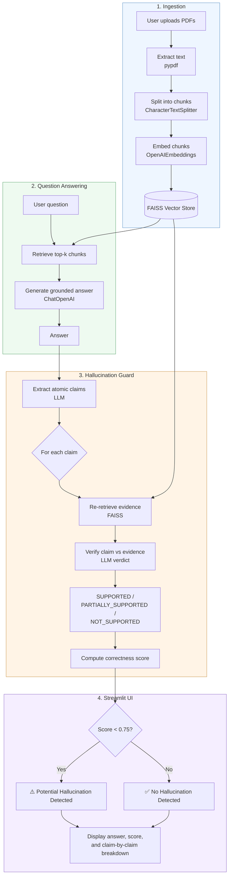

# ClaimCheck

**ClaimCheck** is a hallucination guard that sits between a RAG pipeline and the user — verifying every factual claim in a generated answer against the retrieved source documents *before* the answer is trusted.

Instead of just showing you an LLM's answer and hoping it's grounded in your documents, ClaimCheck breaks the answer into atomic factual claims, retrieves fresh evidence for each one, and scores how well the evidence actually supports what was said.

## Why

RAG reduces hallucinations, but it doesn't eliminate them — a model can still overgeneralize, merge unrelated facts, or state something the retrieved context never actually said. ClaimCheck adds a verification layer on top of a standard RAG answer, so you get a correctness score and a claim-by-claim breakdown instead of just an unverified response.

## How it works

1. **Upload** — Add one or more PDF documents as your knowledge source.
2. **Process** — Documents are split into chunks and embedded into a FAISS vector store.
3. **Ask** — Ask a question; the app retrieves relevant chunks and generates an answer grounded strictly in that context (it answers "I don't know" if the context doesn't cover it).
4. **Verify** — The answer is decomposed into individual atomic claims.
5. **Re-retrieve & Score** — Each claim is independently re-checked against freshly retrieved evidence and classified as:
   - `SUPPORTED`
   - `PARTIALLY_SUPPORTED`
   - `NOT_SUPPORTED`

   A correctness score is computed from these verdicts (supported = 1, partially supported = 0.5, not supported = 0), and a warning is raised if the score falls below a threshold.

## Architecture



## Tech stack

- **Streamlit** — UI
- **LangChain** (`langchain`, `langchain-community`, `langchain-text-splitters`, `langchain-openai`) — RAG orchestration
- **OpenAI** — LLM (`ChatOpenAI`) and embeddings (`OpenAIEmbeddings`)
- **FAISS** (`faiss-cpu`) — vector store
- **pypdf** — PDF text extraction
- **python-dotenv** — environment variable management

## Getting started

### Prerequisites

- Python 3.9+
- An OpenAI API key

### Installation

```bash
git clone https://github.com/IshitwoKhanra/ClaimCheck.git
cd ClaimCheck
pip install -r requirements.txt
```

### Configuration

Create a `.env` file in the project root:

```env
OPENAI_API_KEY=your_openai_api_key_here
```

### Run

```bash
streamlit run app.py
```

Then open the local URL Streamlit prints in your terminal (typically `http://localhost:8501`).

## Usage

1. Upload one or more PDF files from the sidebar and click **Process**.
2. Once processing finishes, type a question in the main input box.
3. Review the generated **Answer**, the **Correctness Score**, and the expandable **Claim Verification** panel showing each extracted claim with its verdict.
4. A score below `0.75` triggers a "Potential Hallucination Detected" warning; otherwise the answer is marked as verified.

## Project structure

```
ClaimCheck/
├── app.py              # Streamlit app: RAG pipeline + claim verification logic
├── requirements.txt    # Python dependencies
├── .devcontainer/      # Dev container config
└── .gitignore
```

## Roadmap ideas

- Support for non-PDF sources (URLs, plain text, DOCX)
- Swap in open-source/local LLMs and embeddings as an alternative to OpenAI
- Persisted vector stores across sessions
- Configurable hallucination threshold from the UI

## Author

Built by **Ishitwo Khanra**.

## License

No license has been specified yet for this repository. Consider adding one (e.g. MIT) if you intend for others to reuse this code.